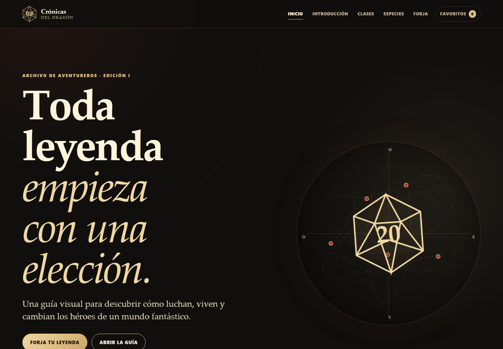
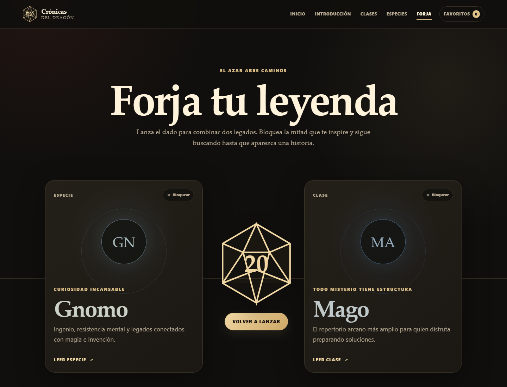

# Crónicas del Dragón

Portfolio frontend editorial e interactivo construido con React y TypeScript. El proyecto transforma un sitio HTML heredado en una experiencia moderna para explorar clases, especies y conceptos de personaje.



## Qué demuestra

- Arquitectura por componentes y rutas con carga diferida.
- Datos tipados separados de la presentación.
- Búsqueda y filtros sincronizados con la URL.
- Favoritos y combinaciones persistentes mediante `localStorage` versionado.
- Diseño responsive desde 320 px, navegación por teclado y movimiento reducido.
- Pruebas unitarias, de componentes, accesibilidad automática y recorridos E2E.
- Contenido original apoyado en material permitido del SRD 5.2.1.

## Experiencia

La aplicación incluye:

- Inicio editorial con un atlas y d20 vectoriales creados en CSS/SVG.
- Introducción al ritmo de una partida de rol.
- Catálogos completos de 12 clases y 9 especies del SRD.
- Fichas individuales con capítulos plegables y navegación interna.
- Favoritos persistentes.
- **Forja tu leyenda**, un generador que combina clase y especie, permite bloquear elecciones y guardar resultados.
- Redirección de `/razas` a la nomenclatura actual `/especies` y página 404.



## Stack

- Vite 8
- React 19
- TypeScript
- React Router
- CSS nativo con tokens, `clamp()`, `color-mix()` y diseño responsive
- Vitest, Testing Library y axe-core
- Playwright
- ESLint y Prettier

## Desarrollo

Requiere Node.js 22 o posterior.

```bash
npm install
npm run dev
```

La aplicación estará disponible en `http://localhost:4173`.

## Calidad

```bash
npm run format:check
npm run lint
npm test
npm run test:e2e
npm run build
```

El build de producción queda en `dist/`. Al usar `BrowserRouter`, un hosting estático debe redirigir las rutas desconocidas a `index.html`.

## Despliegue en Vercel

El repositorio incluye `vercel.json` para que las rutas de React Router, como `/clases/barbaro`, funcionen también al abrirlas o recargarlas directamente.

1. Sube los últimos cambios a GitHub:

   ```bash
   git push origin master
   ```

2. Entra en [vercel.com/new](https://vercel.com/new) e inicia sesión con GitHub.
3. Importa el repositorio `jjimealf/Proyecto-Web`.
4. Comprueba la configuración detectada:
   - Framework Preset: `Vite`
   - Build Command: `npm run build`
   - Output Directory: `dist`
   - Install Command: `npm install`
5. Pulsa **Deploy**.

Vercel proporcionará una dirección del tipo `https://proyecto-web.vercel.app`. Cada nuevo `push` a la rama de producción generará automáticamente una nueva versión.

Para usar un dominio propio, abre el proyecto en Vercel y entra en **Settings → Domains**.

## Arquitectura

```text
src/
├── components/   # UI reutilizable, navegación y lectura
├── context/      # Estado global de favoritos
├── data/         # Catálogos tipados
├── hooks/        # Metadatos por ruta
├── pages/        # Rutas cargadas bajo demanda
├── styles/       # Sistema visual completo
├── test/         # Configuración de pruebas
├── types/        # Contratos públicos del dominio
└── utils/        # Filtros, persistencia y generador
```

El sitio anterior se conserva en `legacy/` y en el commit inicial para documentar la evolución. No participa en el build moderno.

## Accesibilidad

- Enlace para saltar al contenido.
- Orden semántico de encabezados y landmarks.
- Controles con nombre accesible y estados `aria-expanded`/`aria-pressed`.
- Foco visible y objetivos táctiles amplios.
- Navegación móvil operable con teclado y cierre mediante `Escape`.
- Soporte de `prefers-reduced-motion`.
- Contraste y jerarquía pensados para WCAG 2.2 AA.

## Contenido y atribución

Los textos editoriales de esta aplicación son resúmenes originales. Los conceptos de reglas se apoyan en el **System Reference Document 5.2.1**.

This work includes material from the System Reference Document 5.2.1 ("SRD 5.2.1") by Wizards of the Coast LLC, available at [D&D Beyond](https://www.dndbeyond.com/srd). The SRD 5.2.1 is licensed under the [Creative Commons Attribution 4.0 International License](https://creativecommons.org/licenses/by/4.0/).

Crónicas del Dragón es un proyecto de portfolio gratuito y no está afiliado, respaldado ni patrocinado por Wizards of the Coast.

Todo el arte utilizado en la aplicación moderna está generado mediante CSS y SVG propios. Las imágenes del sitio anterior permanecen aisladas en `legacy/` y no se muestran ni distribuyen en el build.

## Estado

La aplicación está preparada para ejecución local y para un futuro despliegue estático con fallback de SPA. El workflow de GitHub Actions ejecuta formato, lint, pruebas unitarias, E2E y build.
